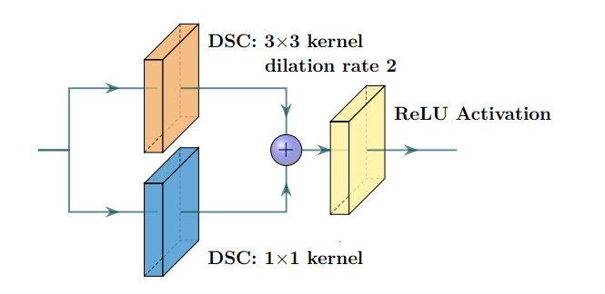
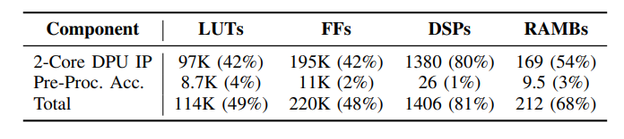
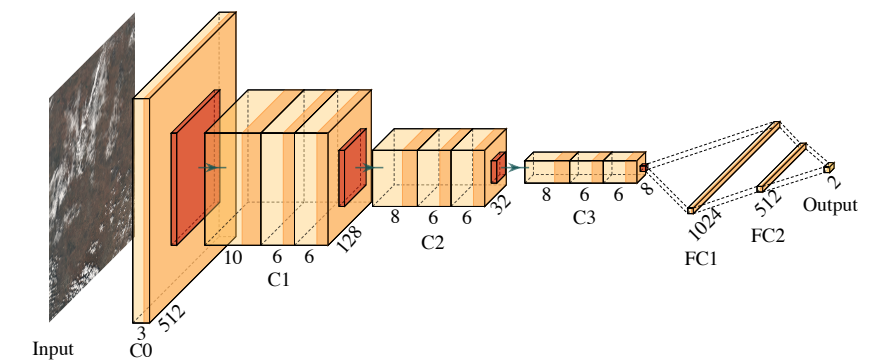
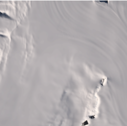

## [`SoC FPGA Acceleration for Semantic Segmentation of Clouds in Satellite Images`][1]

[1]: https://ieeexplore.ieee.org/document/9939585

### Summary

`卫星图像语义分割`

<div class="grid cards" markdown>

* __Network__: Lightweight Dilation U-Net
* __Dataset__: 95-Cloud Dataset
* __Device__: Xilinx MPSoC FPGA
* __Platform__: Vitis AI framework

</div>

`trade-off`

* accuracy
* execution time & hardware resources

`LD-UNet`
LD-UNet是UNet的简化版，减少computational cost和memory footprint，同时保持competitive performance.

  |                             |         LD-UNet         | UNet     |
  | :-------------------------: | :---------------------: | :------: |
  | downsampling and upsampling |            2            |    4     |
  |         convolution         | Dilation Residual Block | standard |

<figure markdown>
  { width="500" }
  <figcaption> The LD-UNet CNN model </figcaption>
  { width="500" }
  <figcaption> The custom Dilation Residual Block </figcaption>
</figure>

The first DSC involves a dilated depthwise convolution with a 3×3 kernel, dilation rate of 2 and stride 1 to __increase the receptive field__ of the convolution. The second DSC involves a depthwise convolution with a 1×1 kernel, acting as the identity __shortcut__ of the residual block.

Compare with other model -> best trade-off between param & accuracy

<figure markdown>
  { width="500" }
  <figcaption> Performance comparision </figcaption>
</figure>

`FPGA architecture`

ZYNQ分为两大部分——PS和PL：

- PS——post-processing
- PL——pre-processing(kernal) & inference(DPU)

<figure markdown>
  { width="500" }
  <figcaption> The FPGA processing architecture </figcaption>
</figure>

`result`

<figure markdown>
  { width="500" }
  <figcaption> Resources utilization </figcaption>
  { width="500" }
  <figcaption> Execution time </figcaption>
</figure>

## [`CloudSatNet-1: FPGA-Based Hardware-Accelerated Quantized CNN for Satellite On-Board Cloud Coverage Classification`][2]

[2]: https://www.semanticscholar.org/reader/5117475276af7c26e1f237241159d72ebda16f13

### Summary

`云层覆盖分类CNN的FPGA加速`

<div class="grid" markdown>

* __Network__: CloudSatNet-1
* __Dataset__: L8 biome Dataset
* __Device__: Xilinx Zynq-7020

</div>

!!! tip "Why cloud coverage classification?"

    satellite data :arrow_up: :point_right: downlink resourcecs tight :point_right: on-board classification

    通过分类丢弃被云覆盖的卫星图像，节省传输带宽

`method`

The current methods for cloud coverage estimation or classification are mainly categorized into __traditional__ and __machine-learning-based__ approaches


=== "Threshold-based (fixed or adaptive) method"

    Rely on a visible reflection and infrared temperature of the clouds :arrow_right: performance weakens on low-contrasted images

=== "Time differentiation"

    Do not consider changes in the top of atmosphere reflectance affected by floods.

=== "Statistical methods"

    Combine spectral and spatial features extracted from RSIs with classical machine learning algorithms (support vector machine, decision tree), but they lack to obtain the desired results

`neural network`

<figure markdown>
  { width="500" }
  <figcaption> CloudSatNet-1 architecture </figcaption>
</figure>

!!! tip "About quantization"

    * effect: param :arrow_down:  accuracy :arrow_up:  power consumption :arrow_up:  execution time :arrow_down:
    * weight & activations quantization对 __网络性能__ 影响不大，但可以减小 __memory footprint__ 方便在FPGA上的 __部署__ .

主要进行4-bit量化，头尾两层对量化更敏感，因此采用8-bit量化

`workflow`

<figure markdown>
  { width="500" }
  <figcaption>  Scheme of proposed workflow </figcaption>
</figure>

``` title="Quantization Step"

1. floating point model -> quantized onnx model   with QAT
2. quantized onnx model -> HLS code   with FINN framework
3. HLS code -> bit file    with Vivado
4. deploy on FPGA

```

`result`

=== "Metrics for different BW (including snow/ice)"

    <figure markdown>
      { width="500" }
      <figcaption> Results of cloud coverage classification for best-performed models </figcaption>
    </figure>

=== "Relationship between ACC and FPR"

    <figure markdown>
      { width="500" }
      <figcaption> Dependence of model ACC on inverse FPR value </figcaption>
    </figure>

=== "Metrics while deploying on FPGA"

    <figure markdown>
      { width="500" }
      <figcaption> Results of cloud coverage classification for best-performed quantized models on FPGA </figcaption>
    </figure>

=== "Resource utilization"

    <figure markdown>
      { width="500" }
      <figcaption> FPGA resource utilization and performance for different model bit widths and folding setup </figcaption>
    </figure>

!!! tip

    部署在FPGA上只有4/3/2 bit model，因为32 bit占用资源过多无法部署.

snow/ice类别与cloud coverage比较像，难以有效识别.

=== "Snow/Ice without cloud coverage"

    <figure markdown>
      { width="500" }
      <figcaption> Snow/Ice </figcaption>
    </figure>

=== "Water with cloud coverage"

    <figure markdown>
      { width="500" }
      <figcaption> Water </figcaption>
    </figure>

=== "Metrics for different biomes"

    <figure markdown>
      { width="500" }
      <figcaption> Results of cloud coverage classification for best-performed 4-bit width models per biome </figcaption>
    </figure>

!!! tip "Try to exclude snow/ice"

    将snow/ice类别排除进行测试，识别新能显著提升.

`flaw`

- High value of FPR on cloud-like feature (e.g. snow/ice).    :tools: multi-spectral bands
- Original L8 biome dataset were merged to form a binary problem.
- Did not cover the effects of the radiation on the cloud detection system.

### Question

!!! example "宁愿多处理负样本也不愿意丢弃正样本，不是应该使FNR(False Negative Rate)更低吗?"

    However, rather than the highest overall accuracy, this study emphasizes on the low FPR (it is more convenient to process a redundant image than to discard the relevant one).

!!! example "没有具体说怎么控制network throughput. "

    Based on the estimated number of cycles per layer reported in Table 3, it is visible that a bottle-neck in the first layer limited the optimal throughput, and it would require a change in the network architecture to allow a higher throughput target. It was demonstrated that the network throughput can be controlled to target a specific FPS desired by the needs of the mission.

## [`FPGA-Based Implementation of Ship Detection for Satellite On-Board Processing`][3]

[3]: https://ieeexplore.ieee.org/stamp/stamp.jsp?tp=&arnumber=9933643

## [`An FPGA-Based Hybrid Neural Network Accelerator for Embedded Satellite Image Classification`][4]

[4]: https://ieeexplore.ieee.org/document/9180625

## [`FPGA-based Satellite Image Classification for Water Bodies Detection`][5]

[5]: https://ieeexplore.ieee.org/document/9171811

## [`FPGA Implementation of a Hardware Optimized Automatic Target Detection and Classification Algorithm for Hyperspectral Image Analysis`][6]

[6]: https://ieeexplore.ieee.org/stamp/stamp.jsp?tp=&arnumber=9817130

## [`An FPGA-Based Hardware Accelerator for CNNs Inference on Board Satellites: Benchmarking with Myriad 2-Based Solution for the CloudScout Case Study`][7]

[7]: https://www.semanticscholar.org/reader/b3e29278e89c995a9fabf856d4aed21fe0c93d08

## [`H-BNN: FPGA-based binarized convolutional neural network for cloud detection on satellite payload`][8]

[8]: https://ieeexplore.ieee.org/document/10227207

## (Literature Review)[`A Survey of FPGA-based Accelerators for Convolutional Neural Networks`][9]

[9]: https://embdev.net/attachment/378695/2018_NCAA_Mittal_FPGA_Accelerator_CNN.pdf

## [`Tile-Grained Pipeline Architecture for Low Latency CNN Inference`][10]

[10]: https://vast.cs.ucla.edu/sites/default/files/publications/PID5488167.pdf

## [`A High Performance FPGA-based Accelerator for  Large-Scale Convolutional Neural Networks`][11]

[11]: https://ieeexplore.ieee.org/document/7577308

## [`MEM-OPT: A Scheduling and Data Re-Use System to Optimize On-Chip Memory Usage for CNNs On-Board FPGAs`][12]

[12]: https://ieeexplore.ieee.org/document/9163269

## [`A Complete Design Flow for Mapping CNN Onto Embedded FPGA`][13]

[13]: https://ieeexplore.ieee.org/document/7930521

## (Literature Review)[`Deep Learning on FPGAs Past, Present, and Future`][14]

[14]: https://www.semanticscholar.org/reader/ee8c33a09b94377741c8c4e12cfc9174b9bcc7a1
